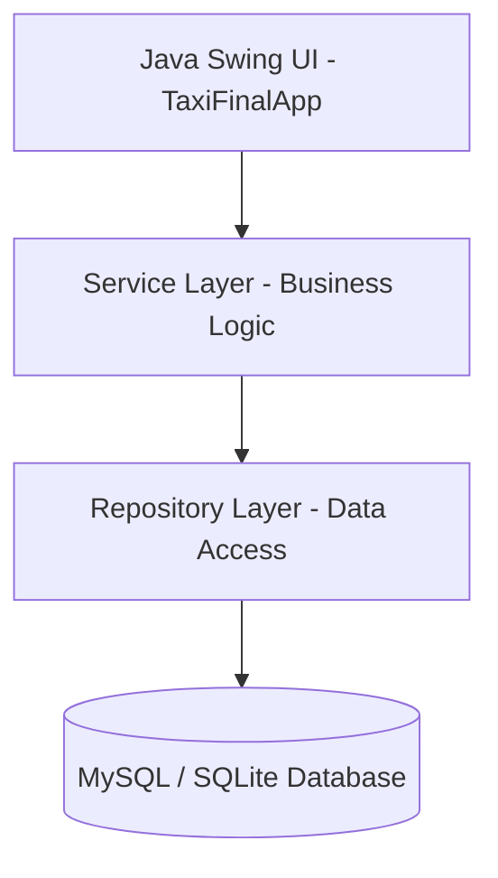

# 🚕 Order A Taxi

**Order A Taxi** is a feature-rich desktop taxi booking and management application built with **Java Swing** and backed by a **MySQL** database (with legacy support for **SQLite**). The project provides an end-to-end simulation of a ride-hailing service, featuring three distinct portals: Passenger, Driver, and Admin.

---

## 🎓 Academic Purpose & Context

This project was developed as a **university school project** for educational purposes. The primary goal was to apply software engineering principles, layered architecture (Service-Repository pattern), and Relational Database Management Systems (RDBMS) in a real-world scenario. Key areas of focus include:
- Object-Oriented Programming (OOP) concepts and design patterns (Singleton, Service Locator, Repository, etc.).
- Creating responsive and highly customized desktop interfaces using Java Swing.
- Database connectivity, query management, and data consistency using JDBC.
- Integration of mapping libraries (JMapViewer) and simulation of location-based services.

*This repository is shared for learning and academic reference. Feel free to explore, clone, and build upon it.*

---

## 🏗️ Software Architecture

The application is structured following the **Layered Architecture (Service-Repository Pattern)** principles to ensure clean separation of concerns:



* **GUI Layer (`TaxiFinalApp.java`):** Swing-based graphical user interface that handles user interactions, screen transitions, and modal dialogs.
* **Service Layer (Services):** Handles business logic and input validation (e.g., `AuthService`, `RideService`, `PricingService`, `MapService`).
* **Repository Layer (Repositories):** Abstracts database read/write operations (e.g., `UserRepository`, `DriverRepository`, `RideRepository`).
* **Service Locator:** Manages and registers service instances, allowing them to be retrieved in the GUI layer in a loosely coupled manner.
* **Singleton Database Manager:** Ensures a single database connection across the entire application for performance optimization.

---

## ✨ Core Features

### 👤 Passenger Portal
* **Interactive Booking Wizard:** Route planning via map picking (using `JMapViewer`) or manual address entry.
* **Scheduled Trips:** Ride booking for a future date/time using `TimePickerDialog` and custom calendar tools.
* **Dynamic Fare Estimation:** Calculates fares on the fly based on route distance, vehicle type (Economy, Premium, XL), and traffic conditions.
* **Payment Simulation:** Seamless credit card or cash payment flow directly within the UI.
* **Ride History & Rating:** View completed trips, rate drivers, and leave comments.
* **Customer Support System:** File tickets for lost items or driver issues.

### 🚕 Driver Dashboard
* **Ride Request Queue:** View, accept, or reject incoming requests.
* **Ride Simulation:** A step-by-step progress tracking simulator that automatically resets driver status to "Available" when the journey completes.
* **Earnings & History Tracker:** Detailed reports and statistics of daily/monthly earnings and job history.

### 🛠️ Admin Panel
* **Driver Approvals:** Review pending driver documents and verify/ban them.
* **System Metrics:** Monitor system-wide revenue, total users/drivers, and active rides.
* **Support Desk:** Read and resolve incoming passenger support tickets.

---

## 🛠️ Technology Stack

* **Language:** Java 17+
* **UI:** Java Swing (with custom premium styling and map integrations)
* **Database:** MySQL (with legacy SQLite configuration support)
* **Connectors & Drivers (JDBC):**
  * `mysql-connector-j-8.3.0.jar`
  * `sqlite-jdbc-3.45.3.0.jar`
  * `JMapViewer.jar` (For OpenStreetMap integration)
  * `jcalendar-1.4.jar` (For calendar picking dialogs)

---

## 📦 Setup & Execution

### 1. Database Configuration
1. Start your local MySQL server.
2. Import [orderataxi.sql](file:///c:/Users/v0rteX/Desktop/Order-A-Taxi/orderataxi.sql) to create the schema and mock data:
   ```bash
   mysql -u root -p < orderataxi.sql
   ```
3. Open [DatabaseManager.java](file:///c:/Users/v0rteX/Desktop/Order-A-Taxi/src/pack/DatabaseManager.java) and set your database user and password credentials:
   ```java
   private static final String DB_URL = "jdbc:mysql://localhost:3306/";
   private static final String DB_USER = "YOUR_USERNAME";
   private static final String DB_PASS = "YOUR_PASSWORD";
   ```

### 2. OpenRouteService API Key Setup
The application uses **OpenRouteService** for routing and real-time distance/ETA calculation.
1. Get a free API Key from [openrouteservice.org](https://openrouteservice.org/).
2. Open [MapService.java](file:///c:/Users/v0rteX/Desktop/Order-A-Taxi/src/pack/MapService.java) and replace the placeholder:
   ```java
   private static String API_KEY = "YOUR_ORS_API_KEY";
   ```
3. Open [TaxiFinalApp.java](file:///c:/Users/v0rteX/Desktop/Order-A-Taxi/src/pack/TaxiFinalApp.java) and replace the placeholder:
   ```java
   MapService.setApiKey("YOUR_ORS_API_KEY");
   ```

### 3. Running the Application (CLI)
Navigate to the project root directory and execute the following commands:

**Windows (PowerShell/CMD):**
```bash
javac -cp "lib/*" -d bin src/pack/*.java
java -cp "bin;lib/*;resources" pack.TaxiFinalApp
```

**macOS / Linux:**
```bash
javac -cp "lib/*" -d bin src/pack/*.java
java -cp "bin:lib/*:resources" pack.TaxiFinalApp
```

*Note: If you are using IDEs like Eclipse, IntelliJ IDEA, or VS Code, the workspace utilizes the `.classpath` configurations to automatically reference the dependencies.*

---

## 🛡️ Demo Accounts (Credentials)

* **Passenger:** Register a new account via the UI.
* **Driver:** `driver` / `123`
* **Admin:** `admin` / `admin`

---

## 📄 License

This project is licensed under the [MIT License](file:///c:/Users/v0rteX/Desktop/Order-A-Taxi/LICENSE). See the `LICENSE` file for more details.

---
**Developer:** Ertandev

